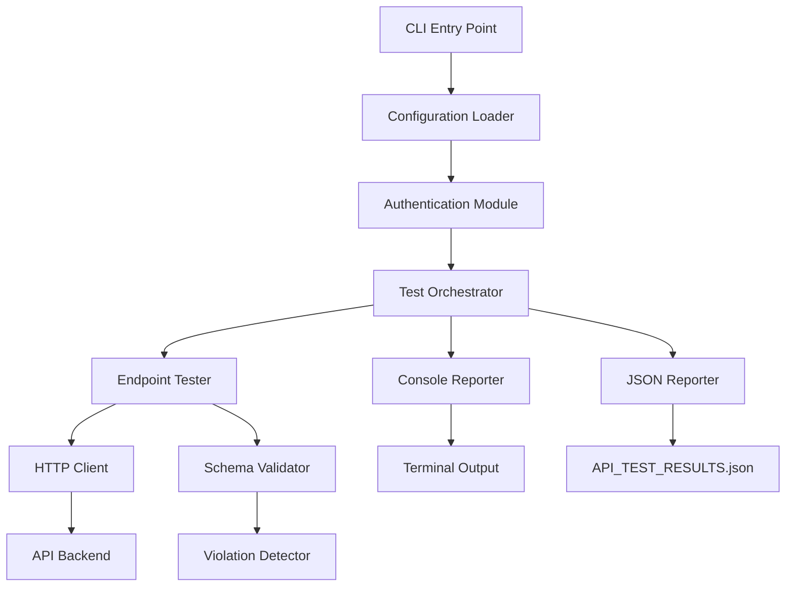

# Design Document: API Contract Testing Tool

## Overview

The API Contract Testing Tool is a standalone TypeScript script that validates backend API endpoints against expected frontend data contracts. The tool provides automated testing of API response structures to ensure frontend-backend integration integrity and catch breaking changes early in the development cycle.

The tool operates as a command-line script that:

1. Authenticates with the API using environment-based credentials
2. Systematically tests configured endpoints organized by feature area
3. Validates response structures against expected schemas
4. Detects and reports contract violations
5. Generates both console and JSON reports

This design leverages TypeScript for type safety, Node.js for runtime execution, and fast-check for property-based testing of schema validation logic.

## Architecture

### High-Level Architecture



### Component Responsibilities

**CLI Entry Point**: Initializes the testing process, loads environment variables, and coordinates the overall test execution flow.

**Configuration Loader**: Loads and validates endpoint configurations, including feature groupings, endpoint definitions, and expected schemas.

**Authentication Module**: Handles API authentication using either token-based or email/password authentication, stores authentication tokens, and injects tokens into subsequent requests.

**Test Orchestrator**: Coordinates the execution of all endpoint tests, manages test sequencing, and aggregates results for reporting.

**Endpoint Tester**: Executes individual endpoint tests, handles list-to-detail endpoint chaining, and manages test lifecycle.

**HTTP Client**: Wraps HTTP request functionality, handles authentication headers, manages timeouts, and provides error handling.

**Schema Validator**: Compares actual API responses against expected schemas, validates field presence and types, and handles nested structures recursively.

**Violation Detector**: Identifies and categorizes contract violations, captures violation details, and formats violation information for reporting.

**Console Reporter**: Displays real-time test results in the terminal with color-coded output for passing and failing tests.

**JSON Reporter**: Generates structured JSON reports containing all test results, violations, and metadata.

## Components and Interfaces

### Type Definitions

```typescript
// Core types for schema validation
type SchemaType = "string" | "number" | "boolean" | "object" | "array" | "null";

interface SchemaField {
  type: SchemaType;
  required: boolean;
  arrayItemSchema?: Schema;
  objectSchema?: Schema;
}

interface Schema {
  [fieldName: string]: SchemaField;
}

// Endpoint configuration types
interface EndpointConfig {
  path: string;
  method: "GET" | "POST" | "PUT" | "DELETE";
  schema: Schema;
  detailEndpoints?: DetailEndpointConfig[];
}

interface DetailEndpointConfig {
  pathTemplate: string; // e.g., "/opportunities/:id"
  idField: string; // e.g., "id" - field from list response to use
  schema: Schema;
}

interface FeatureConfig {
  name: string;
  endpoints: EndpointConfig[];
}

// Test result types
interface ValidationError {
  type: "missing_field" | "type_mismatch" | "http_error" | "network_error";
  path: string;
  expected?: string;
  actual?: string;
  message: string;
}

interface TestResult {
  endpoint: string;
  method: string;
  passed: boolean;
  errors: ValidationError[];
  timestamp: string;
  responseTime?: number;
}

interface TestReport {
  totalTests: number;
  passedTests: number;
  failedTests: number;
  passRate: number;
  results: TestResult[];
  timestamp: string;
}

// Authentication types
interface AuthConfig {
  type: "token" | "email_password";
  token?: string;
  email?: string;
  password?: string;
}

interface AuthResponse {
  token: string;
  [key: string]: any;
}
```

### Authentication Module Interface

```typescript
interface IAuthenticationModule {
  /**
   * Authenticates with the API using configured credentials
   * @returns Authentication token
   * @throws Error if authentication fails
   */
  authenticate(): Promise<string>;

  /**
   * Gets the current authentication token
   * @returns Current token or null if not authenticated
   */
  getToken(): string | null;
}

class AuthenticationModule implements IAuthenticationModule {
  constructor(
    private config: AuthConfig,
    private apiBaseUrl: string,
  ) {}

  async authenticate(): Promise<string> {
    // Implementation handles both token and email/password auth
  }

  getToken(): string | null {
    // Returns stored token
  }
}
```

### HTTP Client Interface

```typescript
interface IHttpClient {
  /**
   * Executes an HTTP request with authentication
   * @param method HTTP method
   * @param path Endpoint path
   * @param token Authentication token
   * @returns Response data
   */
  request<T>(method: string, path: string, token: string): Promise<T>;
}

class HttpClient implements IHttpClient {
  constructor(
    private baseUrl: string,
    private timeout: number = 30000,
  ) {}

  async request<T>(method: string, path: string, token: string): Promise<T> {
    // Implementation uses fetch with timeout and error handling
  }
}
```

### Schema Validator Interface

```typescript
interface ISchemaValidator {
  /**
   * Validates a response against an expected schema
   * @param data Actual response data
   * @param schema Expected schema
   * @returns Array of validation errors (empty if valid)
   */
  validate(data: any, schema: Schema): ValidationError[];

  /**
   * Validates a single field against its schema definition
   * @param value Field value
   * @param fieldSchema Field schema definition
   * @param path Field path for error reporting
   * @returns Array of validation errors
   */
  validateField(
    value: any,
    fieldSchema: SchemaField,
    path: string,
  ): ValidationError[];
}

class SchemaValidator implements ISchemaValidator {
  validate(data: any, schema: Schema): ValidationError[] {
    // Recursively validates all fields
  }

  validateField(
    value: any,
    fieldSchema: SchemaField,
    path: string,
  ): ValidationError[] {
    // Validates individual field with type checking
  }
}
```

### Test Orchestrator Interface

```typescript
interface ITestOrchestrator {
  /**
   * Executes all configured tests
   * @param features Feature configurations to test
   * @returns Complete test report
   */
  runTests(features: FeatureConfig[]): Promise<TestReport>;
}

class TestOrchestrator implements ITestOrchestrator {
  constructor(
    private httpClient: IHttpClient,
    private validator: ISchemaValidator,
    private authToken: string,
  ) {}

  async runTests(features: FeatureConfig[]): Promise<TestReport> {
    // Orchestrates test execution across all features
  }

  private async testEndpoint(endpoint: EndpointConfig): Promise<TestResult> {
    // Tests a single endpoint
  }

  private async testDetailEndpoints(
    listResponse: any[],
    detailConfigs: DetailEndpointConfig[],
  ): Promise<TestResult[]> {
    // Tests detail endpoints using IDs from list response
  }
}
```

### Reporter Interfaces

```typescript
interface IConsoleReporter {
  /**
   * Reports a test result to the console
   * @param result Test result to report
   */
  reportTest(result: TestResult): void;

  /**
   * Reports the final summary
   * @param report Complete test report
   */
  reportSummary(report: TestReport): void;
}

interface IJsonReporter {
  /**
   * Exports test report to JSON file
   * @param report Test report to export
   * @param filePath Output file path
   */
  exportReport(report: TestReport, filePath: string): Promise<void>;
}

class ConsoleReporter implements IConsoleReporter {
  reportTest(result: TestResult): void {
    // Color-coded console output
  }

  reportSummary(report: TestReport): void {
    // Summary with pass rate
  }
}

class JsonReporter implements IJsonReporter {
  async exportReport(report: TestReport, filePath: string): Promise<void> {
    // Writes JSON to file
  }
}
```

## Data Models

### Configuration Structure

The tool uses a programmatic configuration structure defined in TypeScript:

```typescript
const API_CONFIG: FeatureConfig[] = [
  {
    name: "Opportunities",
    endpoints: [
      {
        path: "/opportunities",
        method: "GET",
        schema: {
          id: { type: "string", required: true },
          title: { type: "string", required: true },
          description: { type: "string", required: true },
          budget: { type: "number", required: false },
          status: { type: "string", required: true },
        },
        detailEndpoints: [
          {
            pathTemplate: "/opportunities/:id",
            idField: "id",
            schema: {
              id: { type: "string", required: true },
              title: { type: "string", required: true },
              description: { type: "string", required: true },
              budget: { type: "number", required: false },
              status: { type: "string", required: true },
              applicants: {
                type: "array",
                required: true,
                arrayItemSchema: {
                  id: { type: "string", required: true },
                  name: { type: "string", required: true },
                },
              },
            },
          },
        ],
      },
    ],
  },
  {
    name: "Profile",
    endpoints: [
      {
        path: "/profile",
        method: "GET",
        schema: {
          id: { type: "string", required: true },
          email: { type: "string", required: true },
          name: { type: "string", required: true },
          role: { type: "string", required: true },
        },
      },
    ],
  },
];
```

### Environment Variables

```bash
# API Configuration
API_URL=http://localhost:3000/api/v1

# Authentication (choose one method)
# Method 1: Token-based
ACCESS_TOKEN=your_token_here

# Method 2: Email/Password
EMAIL=user@example.com
PASSWORD=your_password
```

### JSON Report Structure

```json
{
  "totalTests": 15,
  "passedTests": 13,
  "failedTests": 2,
  "passRate": 86.67,
  "timestamp": "2024-01-15T10:30:00.000Z",
  "results": [
    {
      "endpoint": "/opportunities",
      "method": "GET",
      "passed": true,
      "errors": [],
      "timestamp": "2024-01-15T10:30:01.000Z",
      "responseTime": 245
    },
    {
      "endpoint": "/opportunities/123",
      "method": "GET",
      "passed": false,
      "errors": [
        {
          "type": "missing_field",
          "path": "applicants",
          "message": "Required field 'applicants' is missing"
        },
        {
          "type": "type_mismatch",
          "path": "budget",
          "expected": "number",
          "actual": "string",
          "message": "Field 'budget' has incorrect type"
        }
      ],
      "timestamp": "2024-01-15T10:30:02.000Z",
      "responseTime": 189
    }
  ]
}
```

## Correctness Properties

_A property is a characteristic or behavior that should hold true across all valid executions of a system-essentially, a formal statement about what the system should do. Properties serve as the bridge between human-readable specifications and machine-verifiable correctness guarantees._

### Property Reflection

After analyzing all acceptance criteria, I identified several areas of redundancy:

- Properties 3.1 and 9.2 both test core validation behavior - consolidated into Property 1
- Properties 3.6, 3.7, and 9.4 all test error reporting - consolidated into Property 2
- Properties 4.1, 4.2, and 4.3 all test violation detection - consolidated into Property 3
- Properties 2.4 and 2.5 test conditional detail endpoint testing - consolidated into Property 7
- Properties 1.1 and 1.2 test authentication methods - consolidated into Property 8

### Property 1: Schema Validation Correctness

_For any_ API response and expected schema, when all required fields are present with correct types, the validator should mark the validation as passed with no errors.

**Validates: Requirements 3.1, 3.2, 3.3, 9.2, 9.3**

### Property 2: Validation Error Reporting

_For any_ validation failure (missing field or type mismatch), the validator should record the complete field path, the error type, and for type mismatches both the expected and actual types.

**Validates: Requirements 3.6, 3.7, 9.4**

### Property 3: Contract Violation Detection

_For any_ API response that fails validation (missing fields, type mismatches, or HTTP errors), the contract tester should record a violation with the endpoint path, violation type, and detailed debugging information.

**Validates: Requirements 4.1, 4.2, 4.3, 4.4, 4.5, 4.6**

### Property 4: Nested Structure Validation

_For any_ nested object or array structure in an API response, the validator should recursively validate all nested fields against their schemas, reporting errors with complete paths from root to leaf.

**Validates: Requirements 3.4, 3.5**

### Property 5: Authentication Token Persistence

_For any_ successful authentication (token-based or email/password), the authentication module should store the token and include it in all subsequent API requests.

**Validates: Requirements 1.3, 1.5**

### Property 6: Test Execution Resilience

_For any_ test suite with multiple endpoints, when individual tests fail (network errors, timeouts, validation failures), the contract tester should continue executing all remaining tests and complete the full test suite.

**Validates: Requirements 8.1, 8.2, 8.3, 8.4, 8.5**

### Property 7: Conditional Detail Endpoint Testing

_For any_ list endpoint with configured detail endpoints, when the list response contains data, the tester should execute detail endpoint tests using identifiers from the list response; when the list response is empty, the tester should skip detail endpoint tests.

**Validates: Requirements 2.4, 2.5**

### Property 8: Authentication Method Configuration

_For any_ authentication configuration (token-based with ACCESS_TOKEN or email/password with EMAIL and PASSWORD), the authentication module should successfully authenticate using the provided credentials and return a valid token.

**Validates: Requirements 1.1, 1.2**

### Property 9: Authentication Failure Handling

_For any_ authentication attempt with invalid credentials, the contract tester should log detailed error information and terminate execution without proceeding to endpoint tests.

**Validates: Requirements 1.4**

### Property 10: Configuration Loading

_For any_ valid endpoint configuration structure with feature groupings, endpoint definitions, and schemas (including nested schemas), the contract tester should successfully load and organize the configuration for test execution.

**Validates: Requirements 2.1, 2.2, 7.2, 7.3, 7.4, 7.5, 7.6**

### Property 11: Sequential Endpoint Execution

_For any_ configured test suite, the contract tester should execute all endpoints in sequence, testing each endpoint exactly once (plus detail endpoints when applicable).

**Validates: Requirements 2.3, 2.6**

### Property 12: JSON Report Completeness

_For any_ completed test suite, the JSON report should contain all tested endpoints with their pass/fail status, detailed violation information for failures, overall pass rate, and timestamp metadata.

**Validates: Requirements 6.1, 6.3, 6.4, 6.5, 6.6, 6.7**

### Property 13: Console Report Content

_For any_ test result, the console output should include the endpoint path, and for failed tests should include missing fields, type mismatches, and HTTP error codes.

**Validates: Requirements 5.4, 5.5, 5.6, 5.7**

### Property 14: Pass Rate Calculation

_For any_ test suite with N total tests and P passing tests, the reported pass rate should equal (P / N) \* 100, displayed in both console and JSON reports.

**Validates: Requirements 5.8, 6.6**

### Property 15: Environment Configuration

_For any_ API base URL provided via the API_URL environment variable, the contract tester should use that URL for all API requests.

**Validates: Requirements 7.1**

### Property 16: Validation Round Trip

_For any_ API response that exactly matches its expected schema (all required fields present with correct types), validating the response should produce zero errors and mark the test as passed.

**Validates: Requirements 9.5**

## Error Handling

### Authentication Errors

**Token Authentication Failures**: When ACCESS_TOKEN is invalid or expired, the authentication module logs the error with details and terminates execution with exit code 1.

**Email/Password Authentication Failures**: When EMAIL or PASSWORD credentials are invalid, the authentication module logs the error with details and terminates execution with exit code 1.

**Missing Credentials**: When required environment variables are missing, the tool logs a clear error message indicating which variables are needed and terminates with exit code 1.

### Network Errors

**Connection Failures**: When the API is unreachable, the HTTP client records a network_error violation for the endpoint and continues testing remaining endpoints.

**Timeout Errors**: When requests exceed the configured timeout (default 30 seconds), the HTTP client records a timeout violation and continues testing.

**DNS Resolution Failures**: When the API URL cannot be resolved, the tool logs the error and terminates execution.

### Validation Errors

**Unexpected Response Structure**: When the API returns a structure that doesn't match any expected pattern, the validator records all mismatches and continues testing.

**Null Values**: When required fields contain null values, the validator treats this as a missing field violation.

**Extra Fields**: The validator ignores extra fields not defined in the schema (permissive validation).

### HTTP Error Responses

**4xx Client Errors**: Recorded as http_error violations with the status code and endpoint path.

**5xx Server Errors**: Recorded as http_error violations with the status code and endpoint path.

**Non-JSON Responses**: When the API returns non-JSON content, the validator records a parsing error violation.

### Configuration Errors

**Invalid Schema Definitions**: When schemas contain invalid type definitions, the tool logs the error and terminates during configuration loading.

**Malformed Endpoint Configurations**: When endpoint configurations are missing required fields, the tool logs the error and terminates during configuration loading.

### File System Errors

**Report Write Failures**: When the JSON report cannot be written (permissions, disk space), the tool logs the error but still displays console results.

**Working Directory Issues**: When the current directory is not writable, the tool attempts to write to a temporary directory and logs the alternate location.

## Testing Strategy

### Dual Testing Approach

The API Contract Testing Tool will be validated using both unit tests and property-based tests:

**Unit Tests**: Focus on specific examples, edge cases, and integration points:

- Authentication with specific valid/invalid credentials
- Validation of specific response structures with known violations
- Error handling for specific HTTP status codes
- File system operations for report generation
- Console output formatting for specific test results

**Property-Based Tests**: Verify universal properties across all inputs:

- Schema validation correctness across randomly generated responses and schemas
- Nested structure validation with varying depths and complexities
- Error resilience across randomly generated failure scenarios
- Configuration loading with randomly generated endpoint configurations
- Pass rate calculation accuracy across varying test result distributions

### Property-Based Testing Configuration

**Library**: fast-check (already available in the project)

**Test Configuration**:

- Minimum 100 iterations per property test
- Each test tagged with format: **Feature: api-contract-testing, Property {number}: {property_text}**
- Custom generators for API responses, schemas, and configurations

**Example Property Test Structure**:

```typescript
import fc from "fast-check";
import { describe, it, expect } from "vitest";

describe("Schema Validator Properties", () => {
  it("Property 1: Schema Validation Correctness", () => {
    // Feature: api-contract-testing, Property 1: Schema Validation Correctness
    fc.assert(
      fc.property(
        fc.record({
          id: fc.string(),
          name: fc.string(),
          age: fc.integer(),
        }),
        (response) => {
          const schema = {
            id: { type: "string", required: true },
            name: { type: "string", required: true },
            age: { type: "number", required: true },
          };

          const validator = new SchemaValidator();
          const errors = validator.validate(response, schema);

          expect(errors).toHaveLength(0);
        },
      ),
      { numRuns: 100 },
    );
  });

  it("Property 2: Validation Error Reporting", () => {
    // Feature: api-contract-testing, Property 2: Validation Error Reporting
    fc.assert(
      fc.property(
        fc.record({
          id: fc.string(),
          // name field intentionally missing
          age: fc.string(), // wrong type
        }),
        (response) => {
          const schema = {
            id: { type: "string", required: true },
            name: { type: "string", required: true },
            age: { type: "number", required: true },
          };

          const validator = new SchemaValidator();
          const errors = validator.validate(response, schema);

          // Should have error for missing 'name'
          const missingNameError = errors.find(
            (e) => e.type === "missing_field" && e.path === "name",
          );
          expect(missingNameError).toBeDefined();

          // Should have error for wrong type 'age'
          const typeMismatchError = errors.find(
            (e) =>
              e.type === "type_mismatch" &&
              e.path === "age" &&
              e.expected === "number" &&
              e.actual === "string",
          );
          expect(typeMismatchError).toBeDefined();
        },
      ),
      { numRuns: 100 },
    );
  });
});
```

### Unit Test Examples

```typescript
describe("Authentication Module", () => {
  it("should authenticate with valid token", async () => {
    const authModule = new AuthenticationModule(
      { type: "token", token: "valid_token_123" },
      "http://localhost:3000/api/v1",
    );

    const token = await authModule.authenticate();
    expect(token).toBe("valid_token_123");
  });

  it("should throw error with invalid credentials", async () => {
    const authModule = new AuthenticationModule(
      { type: "email_password", email: "invalid@test.com", password: "wrong" },
      "http://localhost:3000/api/v1",
    );

    await expect(authModule.authenticate()).rejects.toThrow();
  });
});

describe("JSON Reporter", () => {
  it("should write report to API_TEST_RESULTS.json", async () => {
    const reporter = new JsonReporter();
    const report: TestReport = {
      totalTests: 2,
      passedTests: 1,
      failedTests: 1,
      passRate: 50,
      results: [],
      timestamp: new Date().toISOString(),
    };

    await reporter.exportReport(report, "API_TEST_RESULTS.json");

    // Verify file exists and contains correct data
    const fileContent = await fs.readFile("API_TEST_RESULTS.json", "utf-8");
    const parsed = JSON.parse(fileContent);
    expect(parsed.totalTests).toBe(2);
    expect(parsed.passRate).toBe(50);
  });
});
```

### Test Coverage Goals

- **Unit Test Coverage**: Minimum 80% code coverage for all modules
- **Property Test Coverage**: All 16 correctness properties implemented as property-based tests
- **Integration Tests**: End-to-end tests with mock API server for complete workflow validation
- **Edge Case Coverage**: Specific unit tests for boundary conditions (empty arrays, null values, deeply nested structures)

### Continuous Integration

The test suite should be integrated into CI/CD pipelines:

- Run on every pull request
- Fail builds if any property test fails
- Generate coverage reports
- Archive JSON test reports as artifacts
