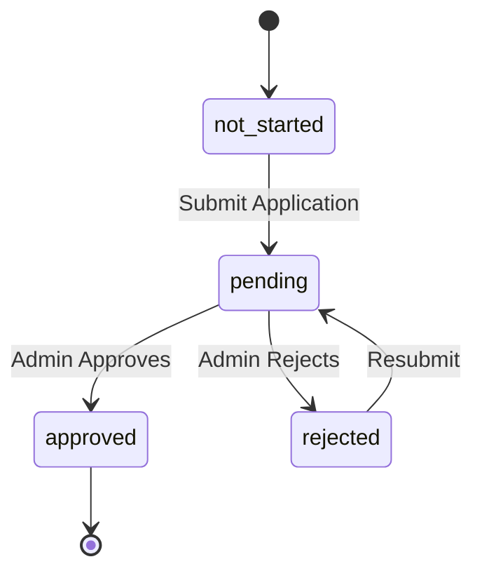

# Business Verification Integration - Design Document

## Overview

The Business Verification Integration feature enables business users (employers/recruiters) to verify their business identity through a comprehensive verification workflow. This design implements a multi-step verification process with document upload capabilities, real-time status tracking, and visual verification indicators throughout the application.

The system integrates seamlessly with the existing Next.js 14 application, following established patterns for API communication, state management with React Query, and component architecture. The verification status is displayed across multiple touchpoints including dashboards, navigation, profiles, and opportunity listings to build trust with talent users.

### Key Design Goals

1. Provide a smooth, intuitive verification submission experience
2. Enable real-time status tracking with polling for pending verifications
3. Display verification status consistently across all relevant UI surfaces
4. Follow existing codebase patterns and conventions
5. Ensure mobile-responsive design across all components
6. Maintain accessibility standards throughout the verification flow

## Architecture

### System Architecture

```mermaid
graph TB
    subgraph "Frontend Application"
        UI[UI Components]
        Hook[useBusinessVerification Hook]
        API[API Layer]
    end

    subgraph "State Management"
        RQ[React Query Cache]
        Poll[Polling Mechanism]
    end

    subgraph "Backend API"
        VER[/verification endpoints]
        DOC[/document upload]
    end

    UI --> Hook
    Hook --> RQ
    Hook --> Poll
    RQ --> API
    API --> VER
    API --> DOC
    Poll --> Hook
```

### Data Flow

1. **Submission Flow**
   - User fills multi-step form → Form validation → API submission → Status update → Cache invalidation → UI refresh

2. **Status Tracking Flow**
   - Component mounts → React Query fetch → Display status → If pending: Start polling → Poll every 30s → Update on change

3. **Document Upload Flow**
   - User selects file → Client validation → FormData creation → API upload → Preview display → Add to document list

4. **Resubmission Flow**
   - User clicks resubmit → Fetch previous data → Pre-fill form → Allow edits → Submit → Reset to pending

### Directory Structure

```
lib/api/verification/
├── index.ts              # API functions using apiClient
├── types.ts              # TypeScript interfaces

hooks/
├── useBusinessVerification.ts  # React Query hook

components/verification/
├── VerificationStatusBanner.tsx    # Reusable status banner
├── ApplicationForm.tsx             # Multi-step form
├── DocumentUploader.tsx            # File upload component
├── VerificationDashboard.tsx       # Main page orchestrator
├── VerifiedBadge.tsx               # Badge for profiles
└── StatusTimeline.tsx              # Visual status tracker

app/(business)/verification/
└── page.tsx              # Main verification route
```

## Components and Interfaces

### API Layer

#### lib/api/verification/types.ts

```typescript
export type VerificationStatus =
  | "not_started"
  | "pending"
  | "approved"
  | "rejected";

export interface BusinessVerificationData {
  businessName: string;
  registrationNumber: string;
  businessType: string;
  address: string;
  city: string;
  state: string;
  country: string;
  website?: string;
  phoneNumber: string;
  documents: string[]; // Document IDs
}

export interface VerificationApplication {
  id: string;
  userId: string;
  status: VerificationStatus;
  submittedAt: string;
  updatedAt: string;
  reviewedAt?: string;
  rejectionReason?: string;
  data: BusinessVerificationData;
}

export interface VerificationStatusResponse {
  status: VerificationStatus;
  application?: VerificationApplication;
}

export interface DocumentUploadResponse {
  documentId: string;
  url: string;
  filename: string;
}

export interface SubmitVerificationRequest {
  data: BusinessVerificationData;
}

export interface ResubmitVerificationRequest {
  applicationId: string;
  data: BusinessVerificationData;
}
```

#### lib/api/verification/index.ts

```typescript
import apiClient from "@/lib/api";
import type {
  VerificationStatusResponse,
  SubmitVerificationRequest,
  ResubmitVerificationRequest,
  DocumentUploadResponse,
  VerificationApplication,
} from "./types";

/**
 * Submit a new verification application
 * POST /verification/submit
 */
export async function submitVerification(
  request: SubmitVerificationRequest,
): Promise<VerificationApplication> {
  return apiClient<VerificationApplication>("/verification/submit", {
    method: "POST",
    body: request,
  });
}

/**
 * Get current verification status
 * GET /verification/status
 */
export async function getVerificationStatus(): Promise<VerificationStatusResponse> {
  return apiClient<VerificationStatusResponse>("/verification/status", {
    method: "GET",
  });
}

/**
 * Resubmit a rejected verification
 * POST /verification/resubmit
 */
export async function resubmitVerification(
  request: ResubmitVerificationRequest,
): Promise<VerificationApplication> {
  return apiClient<VerificationApplication>("/verification/resubmit", {
    method: "POST",
    body: request,
  });
}

/**
 * Upload a verification document
 * POST /verification/upload-document
 */
export async function uploadDocument(
  file: File,
): Promise<DocumentUploadResponse> {
  const formData = new FormData();
  formData.append("document", file);

  return apiClient<DocumentUploadResponse>("/verification/upload-document", {
    method: "POST",
    body: formData,
  });
}
```

### React Query Hook

#### hooks/useBusinessVerification.ts

```typescript
import { useQuery, useMutation, useQueryClient } from "@tanstack/react-query";
import { useEffect } from "react";
import {
  submitVerification,
  getVerificationStatus,
  resubmitVerification,
  uploadDocument,
  type SubmitVerificationRequest,
  type ResubmitVerificationRequest,
} from "@/lib/api/verification";

const VERIFICATION_QUERY_KEY = ["verification", "status"];
const POLLING_INTERVAL = 30000; // 30 seconds

/**
 * Get verification status with automatic polling for pending status
 */
export function useVerificationStatus() {
  const query = useQuery({
    queryKey: VERIFICATION_QUERY_KEY,
    queryFn: getVerificationStatus,
    staleTime: 5 * 60 * 1000, // 5 minutes
    refetchInterval: (data) => {
      // Poll every 30s if status is pending
      return data?.status === "pending" ? POLLING_INTERVAL : false;
    },
  });

  return query;
}

/**
 * Submit new verification application
 */
export function useSubmitVerification() {
  const queryClient = useQueryClient();

  return useMutation({
    mutationFn: (request: SubmitVerificationRequest) =>
      submitVerification(request),
    onSuccess: () => {
      queryClient.invalidateQueries({ queryKey: VERIFICATION_QUERY_KEY });
    },
  });
}

/**
 * Resubmit rejected verification
 */
export function useResubmitVerification() {
  const queryClient = useQueryClient();

  return useMutation({
    mutationFn: (request: ResubmitVerificationRequest) =>
      resubmitVerification(request),
    onSuccess: () => {
      queryClient.invalidateQueries({ queryKey: VERIFICATION_QUERY_KEY });
    },
  });
}

/**
 * Upload verification document
 */
export function useUploadDocument() {
  return useMutation({
    mutationFn: (file: File) => uploadDocument(file),
  });
}
```

### UI Components

#### components/verification/VerificationStatusBanner.tsx

Reusable banner component that displays verification status with appropriate styling and actions.

**Props:**

- `status`: VerificationStatus
- `rejectionReason?`: string
- `onActionClick`: () => void
- `className?`: string

**Behavior:**

- Displays different messages and colors based on status
- Shows actionable CTA button for pending/rejected states
- Dismissible for approved status
- Mobile-responsive layout

#### components/verification/ApplicationForm.tsx

Multi-step form for verification submission with validation.

**Props:**

- `initialData?`: BusinessVerificationData
- `onSubmit`: (data: BusinessVerificationData) => Promise<void>
- `isSubmitting`: boolean

**Features:**

- 3 steps: Business Info, Contact Details, Document Upload
- Zod schema validation per step
- Progress indicator
- Data persistence between steps
- Mobile-optimized layout

**Validation Rules:**

- Business name: required, min 2 chars
- Registration number: required, alphanumeric
- Phone: required, valid format
- Email: required, valid email
- Documents: at least 1 required

#### components/verification/DocumentUploader.tsx

File upload component with preview and validation.

**Props:**

- `onUpload`: (file: File) => Promise<DocumentUploadResponse>
- `onRemove`: (documentId: string) => void
- `documents`: DocumentUploadResponse[]
- `maxFiles?`: number
- `maxSizeMB?`: number

**Features:**

- Drag-and-drop support
- File type validation (PDF, JPG, PNG)
- Size validation (default 10MB)
- Preview thumbnails
- Upload progress indicator
- Error handling with clear messages

#### components/verification/VerificationDashboard.tsx

Main orchestrator component for the verification page.

**Features:**

- Displays current status
- Shows application form for new/resubmit
- Displays status timeline
- Shows document list
- Handles all state management
- Responsive layout

#### components/verification/VerifiedBadge.tsx

Small badge component to indicate verified status.

**Props:**

- `size?`: 'sm' | 'md' | 'lg'
- `showTooltip?`: boolean
- `className?`: string

**Features:**

- Checkmark icon with "Verified" text
- Tooltip explaining verification
- Accessible with ARIA labels
- Multiple size variants

#### components/verification/StatusTimeline.tsx

Visual timeline showing verification progress.

**Props:**

- `status`: VerificationStatus
- `submittedAt?`: string
- `reviewedAt?`: string
- `rejectionReason?`: string

**Features:**

- Visual progress indicator
- Timestamps for each stage
- Rejection reason display
- Mobile-responsive

### Page Integration

#### app/(business)/verification/page.tsx

Main verification page route.

```typescript
'use client';

import { VerificationDashboard } from '@/components/verification/VerificationDashboard';
import { useRequireRole } from '@/hooks/useRequireRole';

export default function VerificationPage() {
  useRequireRole('recruiter');

  return (
    <div className="container mx-auto px-4 py-6">
      <h1 className="text-2xl font-bold mb-6">Business Verification</h1>
      <VerificationDashboard />
    </div>
  );
}
```

### Integration Points

#### 1. EmployerDashboard.tsx

Add VerificationStatusBanner at the top of the dashboard:

```typescript
import { VerificationStatusBanner } from '@/components/verification/VerificationStatusBanner';
import { useVerificationStatus } from '@/hooks/useBusinessVerification';

// Inside component:
const { data: verificationStatus } = useVerificationStatus();

// Render banner if not approved
{verificationStatus?.status !== 'approved' && (
  <VerificationStatusBanner
    status={verificationStatus?.status || 'not_started'}
    rejectionReason={verificationStatus?.application?.rejectionReason}
    onActionClick={() => router.push('/verification')}
    className="mb-6"
  />
)}
```

#### 2. RecruiterSidebar.tsx

Add verification menu item:

```typescript
const menuItems: MenuItem[] = [
  // ... existing items
  {
    id: 'verification',
    label: 'Verification',
    icon: <ShieldCheckIcon />,
    href: '/verification',
  },
  // ... rest of items
];
```

#### 3. MobileNavigation.tsx

Add verification to mobile menu following existing pattern.

#### 4. EmployerProfilePanel.tsx

Add VerifiedBadge next to employer name:

```typescript
import { VerifiedBadge } from '@/components/verification/VerifiedBadge';

// In render:
<div className="flex items-center gap-2">
  <h2>{employerName}</h2>
  {isVerified && <VerifiedBadge size="md" showTooltip />}
</div>
```

## Data Models

### Verification Application State Machine



### Form State

```typescript
interface FormState {
  currentStep: number;
  data: Partial<BusinessVerificationData>;
  errors: Record<string, string>;
  uploadedDocuments: DocumentUploadResponse[];
}
```

### Validation Schemas

Using Zod for type-safe validation:

```typescript
import { z } from "zod";

export const businessInfoSchema = z.object({
  businessName: z
    .string()
    .min(2, "Business name must be at least 2 characters"),
  registrationNumber: z.string().min(1, "Registration number is required"),
  businessType: z.string().min(1, "Business type is required"),
  address: z.string().min(5, "Address must be at least 5 characters"),
  city: z.string().min(2, "City is required"),
  state: z.string().min(2, "State is required"),
  country: z.string().min(2, "Country is required"),
  website: z.string().url("Invalid URL").optional().or(z.literal("")),
});

export const contactInfoSchema = z.object({
  phoneNumber: z.string().regex(/^\+?[1-9]\d{1,14}$/, "Invalid phone number"),
});

export const documentSchema = z.object({
  documents: z.array(z.string()).min(1, "At least one document is required"),
});

export const fullVerificationSchema = businessInfoSchema
  .merge(contactInfoSchema)
  .merge(documentSchema);
```

## Correctness Properties

_A property is a characteristic or behavior that should hold true across all valid executions of a system-essentially, a formal statement about what the system should do. Properties serve as the bridge between human-readable specifications and machine-verifiable correctness guarantees._

### Property 1: Form Validation Rejects Invalid Data

_For any_ form submission with invalid data (missing required fields, invalid formats, or constraint violations), the system should reject the submission and display specific error messages for each invalid field.

**Validates: Requirements 1.2, 1.4**

### Property 2: Valid Form Submission Triggers API Call

_For any_ valid verification form data, submitting the form should trigger an API call to the backend and display a confirmation message upon success.

**Validates: Requirements 1.3**

### Property 3: Form Step Navigation Preserves Data

_For any_ form data entered in step N, navigating to step N+1 and then back to step N should preserve all previously entered data without loss.

**Validates: Requirements 1.5**

### Property 4: File Upload Validation

_For any_ file upload attempt, the system should validate file type (PDF, JPG, PNG) and size (≤10MB) before accepting, rejecting invalid files with appropriate error messages.

**Validates: Requirements 2.1, 2.3**

### Property 5: Successful Upload Shows Preview

_For any_ valid file that is successfully uploaded, the system should display a preview of the document in the document list.

**Validates: Requirements 2.2**

### Property 6: Document List Reflects Operations

_For any_ sequence of document upload and removal operations, the displayed document list should accurately reflect the current set of documents (adding N documents increases count by N, removing M documents decreases count by M).

**Validates: Requirements 2.4, 2.5**

### Property 7: Status Display Reflects Application State

_For any_ verification application state (pending, approved, rejected, not_started), the system should display the correct status and corresponding UI elements (timeline, rejection reason, prompts).

**Validates: Requirements 3.1, 3.3**

### Property 8: Polling Activates for Pending Status

_For any_ verification with pending status, the system should poll the API every 30 seconds for status updates, and stop polling when status changes to approved or rejected.

**Validates: Requirements 3.2, 8.5**

### Property 9: Resubmission Pre-fills Previous Data

_For any_ rejected verification application, initiating resubmission should pre-fill the form with all previous application data while allowing all fields to be edited.

**Validates: Requirements 4.2, 4.3**

### Property 10: Resubmission Transitions to Pending

_For any_ rejected verification, successfully resubmitting should change the status to pending and trigger a new verification review cycle.

**Validates: Requirements 4.4**

### Property 11: Banner Display Based on Status

_For any_ verification status, the dashboard should display a status banner if and only if the status is not_started, pending, or rejected, with appropriate messaging and actions for each state.

**Validates: Requirements 5.1, 5.3, 5.4, 5.5**

### Property 12: Verified Badge Display

_For any_ employer profile, opportunity listing, or employer card, a verified badge should be displayed if and only if the employer has an approved verification status.

**Validates: Requirements 7.1, 7.2, 7.4, 7.5**

### Property 13: Query Invalidation on Status Change

_For any_ mutation that changes verification status (submit, resubmit), the system should invalidate the verification status query to trigger a refetch and update all components displaying verification data.

**Validates: Requirements 8.2**

### Property 14: React Query Cache Sharing

_For any_ multiple components requesting verification data within the stale time window, the system should serve the data from React Query cache without making additional API calls.

**Validates: Requirements 8.3, 8.4**

### Property 15: API Error Handling Consistency

_For any_ API error response (network error, validation error, server error), the system should handle the error gracefully and display a user-friendly error message without crashing.

**Validates: Requirements 9.4**

### Property 16: Component Prop Consistency

_For any_ reusable component (VerificationStatusBanner, VerifiedBadge, DocumentUploader, StatusTimeline), rendering with the same props should produce consistent output across different usage contexts.

**Validates: Requirements 10.5**

## Error Handling

### Client-Side Errors

1. **Form Validation Errors**
   - Display inline error messages for each invalid field
   - Prevent form submission until all errors are resolved
   - Highlight invalid fields with red borders
   - Show error summary at top of form

2. **File Upload Errors**
   - Invalid file type: "Please upload a PDF, JPG, or PNG file"
   - File too large: "File size must be less than 10MB"
   - Upload failed: "Upload failed. Please try again"
   - Network error: "Network error. Please check your connection"

3. **Network Errors**
   - Display toast notification with retry option
   - Preserve form data for retry
   - Show loading states during retry
   - Timeout after 30 seconds with clear message

### API Error Responses

1. **400 Bad Request**
   - Parse validation errors from response
   - Display field-specific error messages
   - Highlight problematic fields

2. **401 Unauthorized**
   - Handled by apiClient (automatic token refresh)
   - Redirect to login if refresh fails

3. **403 Forbidden**
   - Display: "You don't have permission to perform this action"
   - Suggest contacting support

4. **404 Not Found**
   - Display: "Verification application not found"
   - Offer to start new application

5. **429 Too Many Requests**
   - Display: "Too many requests. Please try again in X minutes"
   - Disable submit button temporarily

6. **500 Server Error**
   - Display: "Server error. Please try again later"
   - Log error for debugging
   - Offer to contact support

### Error Recovery

1. **Form State Preservation**
   - Save form data to component state on each change
   - Preserve data across navigation
   - Clear only on successful submission

2. **Retry Mechanisms**
   - Automatic retry for network errors (max 3 attempts)
   - Manual retry button for failed uploads
   - Exponential backoff for API retries

3. **Graceful Degradation**
   - Show cached status if API fails
   - Display last known state with warning
   - Allow offline form filling (submit when online)

## Testing Strategy

### Dual Testing Approach

This feature will use both unit tests and property-based tests for comprehensive coverage:

- **Unit tests**: Verify specific examples, edge cases, component rendering, and integration points
- **Property tests**: Verify universal properties across all inputs using randomized testing

### Unit Testing

**Component Tests:**

- VerificationStatusBanner: Renders correctly for each status
- ApplicationForm: Step navigation, form submission, validation display
- DocumentUploader: File selection, drag-and-drop, preview display
- VerifiedBadge: Size variants, tooltip display
- StatusTimeline: Timeline rendering for each status

**Integration Tests:**

- Dashboard banner integration
- Navigation menu integration
- Profile badge integration
- Form submission flow end-to-end

**Edge Cases:**

- Empty form submission
- Maximum file size boundary
- Network timeout scenarios
- Rapid status changes
- Multiple simultaneous uploads

### Property-Based Testing

**Configuration:**

- Use fast-check library for TypeScript/JavaScript
- Minimum 100 iterations per property test
- Each test tagged with: **Feature: business-verification-integration, Property {number}: {property_text}**

**Property Test Implementation:**

1. **Property 1: Form Validation**
   - Generate random form data (valid and invalid)
   - Test that invalid data is always rejected with errors
   - Tag: **Feature: business-verification-integration, Property 1: Form Validation Rejects Invalid Data**

2. **Property 3: Form Step Navigation**
   - Generate random form data for each step
   - Navigate forward and backward
   - Verify data preservation
   - Tag: **Feature: business-verification-integration, Property 3: Form Step Navigation Preserves Data**

3. **Property 4: File Upload Validation**
   - Generate files with random types and sizes
   - Test validation rules
   - Tag: **Feature: business-verification-integration, Property 4: File Upload Validation**

4. **Property 6: Document List Operations**
   - Generate random sequences of add/remove operations
   - Verify list count matches operations
   - Tag: **Feature: business-verification-integration, Property 6: Document List Reflects Operations**

5. **Property 7: Status Display**
   - Generate random verification states
   - Verify correct UI elements displayed
   - Tag: **Feature: business-verification-integration, Property 7: Status Display Reflects Application State**

6. **Property 8: Polling Behavior**
   - Test polling activation/deactivation for different statuses
   - Tag: **Feature: business-verification-integration, Property 8: Polling Activates for Pending Status**

7. **Property 11: Banner Display Logic**
   - Generate random verification statuses
   - Verify banner display rules
   - Tag: **Feature: business-verification-integration, Property 11: Banner Display Based on Status**

8. **Property 12: Badge Display Logic**
   - Generate random employer verification states
   - Verify badge display rules
   - Tag: **Feature: business-verification-integration, Property 12: Verified Badge Display**

9. **Property 14: Cache Behavior**
   - Test that multiple components share cached data
   - Tag: **Feature: business-verification-integration, Property 14: React Query Cache Sharing**

10. **Property 16: Component Consistency**
    - Render components with same props multiple times
    - Verify consistent output
    - Tag: **Feature: business-verification-integration, Property 16: Component Prop Consistency**

### Test Data Generators

```typescript
// Example generators for property-based testing
import * as fc from "fast-check";

// Generate valid business verification data
export const validVerificationDataArb = fc.record({
  businessName: fc.string({ minLength: 2, maxLength: 100 }),
  registrationNumber: fc.string({ minLength: 5, maxLength: 20 }),
  businessType: fc.constantFrom(
    "LLC",
    "Corporation",
    "Partnership",
    "Sole Proprietorship",
  ),
  address: fc.string({ minLength: 5, maxLength: 200 }),
  city: fc.string({ minLength: 2, maxLength: 50 }),
  state: fc.string({ minLength: 2, maxLength: 50 }),
  country: fc.constantFrom("Nigeria", "Ghana", "Kenya", "South Africa"),
  website: fc.option(fc.webUrl(), { nil: undefined }),
  phoneNumber: fc.string({ minLength: 10, maxLength: 15 }).map((s) => "+" + s),
  documents: fc.array(fc.uuid(), { minLength: 1, maxLength: 5 }),
});

// Generate invalid verification data
export const invalidVerificationDataArb = fc.record({
  businessName: fc.option(fc.string({ maxLength: 1 }), { nil: undefined }),
  registrationNumber: fc.option(fc.constant(""), { nil: undefined }),
  phoneNumber: fc.option(fc.string({ maxLength: 5 }), { nil: undefined }),
  // ... other invalid fields
});

// Generate file metadata
export const fileMetadataArb = fc.record({
  name: fc.string({ minLength: 1, maxLength: 50 }),
  type: fc.constantFrom(
    "application/pdf",
    "image/jpeg",
    "image/png",
    "text/plain",
    "application/zip",
  ),
  size: fc.integer({ min: 0, max: 20 * 1024 * 1024 }), // 0 to 20MB
});

// Generate verification status
export const verificationStatusArb = fc.constantFrom(
  "not_started",
  "pending",
  "approved",
  "rejected",
);
```

### Manual Testing Checklist

- [ ] Submit new verification application
- [ ] Upload various document types and sizes
- [ ] Navigate between form steps
- [ ] Submit with validation errors
- [ ] Resubmit rejected application
- [ ] Verify polling behavior for pending status
- [ ] Check banner display on dashboard
- [ ] Verify navigation menu item
- [ ] Check mobile responsive layout
- [ ] Test verified badge on profiles
- [ ] Test verified badge on opportunities
- [ ] Verify tooltip on badge hover
- [ ] Test keyboard navigation
- [ ] Test screen reader compatibility
- [ ] Test with slow network connection
- [ ] Test with network disconnection
- [ ] Verify error messages are clear
- [ ] Test on different browsers
- [ ] Test on different devices

## Implementation Notes

### Performance Considerations

1. **Lazy Loading**
   - Lazy load DocumentUploader component
   - Lazy load StatusTimeline component
   - Code-split verification page

2. **Optimistic Updates**
   - Update UI immediately on form submission
   - Revert on API error
   - Show loading states

3. **Caching Strategy**
   - Cache verification status for 5 minutes
   - Invalidate on mutations
   - Poll only when pending

4. **Image Optimization**
   - Compress document previews
   - Use thumbnails for display
   - Lazy load preview images

### Accessibility

1. **Keyboard Navigation**
   - All interactive elements keyboard accessible
   - Logical tab order through form
   - Escape key closes modals

2. **Screen Readers**
   - ARIA labels on all form fields
   - ARIA live regions for status updates
   - Descriptive button labels

3. **Visual Indicators**
   - Don't rely solely on color for status
   - Use icons with text labels
   - High contrast mode support

4. **Focus Management**
   - Focus first error on validation failure
   - Focus confirmation message on success
   - Maintain focus on navigation

### Security Considerations

1. **File Upload Security**
   - Validate file types on client and server
   - Scan uploaded files for malware
   - Limit file size to prevent DoS
   - Use secure file storage

2. **Data Privacy**
   - Don't store sensitive data in localStorage
   - Use HTTPS for all API calls
   - Sanitize user inputs
   - Implement rate limiting

3. **Authentication**
   - Verify user is authenticated
   - Check user role (recruiter only)
   - Validate tokens on each request
   - Handle token expiration gracefully

### Mobile Optimization

1. **Responsive Design**
   - Stack form fields vertically on mobile
   - Larger touch targets (min 44x44px)
   - Simplified navigation on small screens
   - Optimized file upload for mobile

2. **Performance**
   - Minimize bundle size
   - Optimize images for mobile
   - Reduce API calls
   - Use service worker for offline support

3. **UX Enhancements**
   - Native file picker on mobile
   - Camera integration for document capture
   - Swipe gestures for form navigation
   - Bottom sheet for mobile modals

## Dependencies

### External Libraries

- `@tanstack/react-query`: ^5.0.0 - State management and caching
- `zod`: ^3.22.0 - Schema validation
- `react-hook-form`: ^7.48.0 - Form state management
- `sonner`: ^1.2.0 - Toast notifications
- `lucide-react`: ^0.294.0 - Icons

### Internal Dependencies

- `lib/api/index.ts` - API client
- `lib/auth.ts` - Authentication utilities
- `hooks/useProfile.ts` - User profile context
- `hooks/useRequireRole.ts` - Role-based access control
- `components/ui/*` - Shared UI components

## Migration and Rollout

### Phase 1: Core Implementation

- Implement API layer and types
- Create React Query hooks
- Build core components

### Phase 2: Integration

- Integrate with dashboard
- Add navigation menu items
- Implement verified badges

### Phase 3: Testing and Polish

- Write unit tests
- Write property-based tests
- Conduct manual testing
- Fix bugs and polish UI

### Phase 4: Deployment

- Deploy to staging
- Conduct user acceptance testing
- Deploy to production
- Monitor for issues

### Rollback Plan

If critical issues are discovered:

1. Feature flag to disable verification UI
2. Hide navigation menu items
3. Remove dashboard banners
4. Keep API endpoints active for data integrity
5. Fix issues and redeploy

## Future Enhancements

1. **Automated Verification**
   - Integration with business registry APIs
   - Automated document verification
   - Instant verification for known businesses

2. **Enhanced Document Management**
   - Document expiration tracking
   - Automatic renewal reminders
   - Version history for documents

3. **Verification Levels**
   - Basic verification (business exists)
   - Enhanced verification (financial checks)
   - Premium verification (background checks)

4. **Analytics**
   - Track verification completion rates
   - Monitor rejection reasons
   - Measure time to verification

5. **Notifications**
   - Email notifications for status changes
   - SMS notifications for urgent updates
   - In-app notification center

## Conclusion

This design provides a comprehensive solution for business verification integration that follows existing patterns, maintains code quality, and delivers a smooth user experience. The dual testing approach with both unit tests and property-based tests ensures robust correctness guarantees across all scenarios.

The modular component architecture allows for easy maintenance and future enhancements, while the React Query integration provides efficient state management and real-time updates. The design prioritizes accessibility, mobile responsiveness, and security throughout the implementation.
