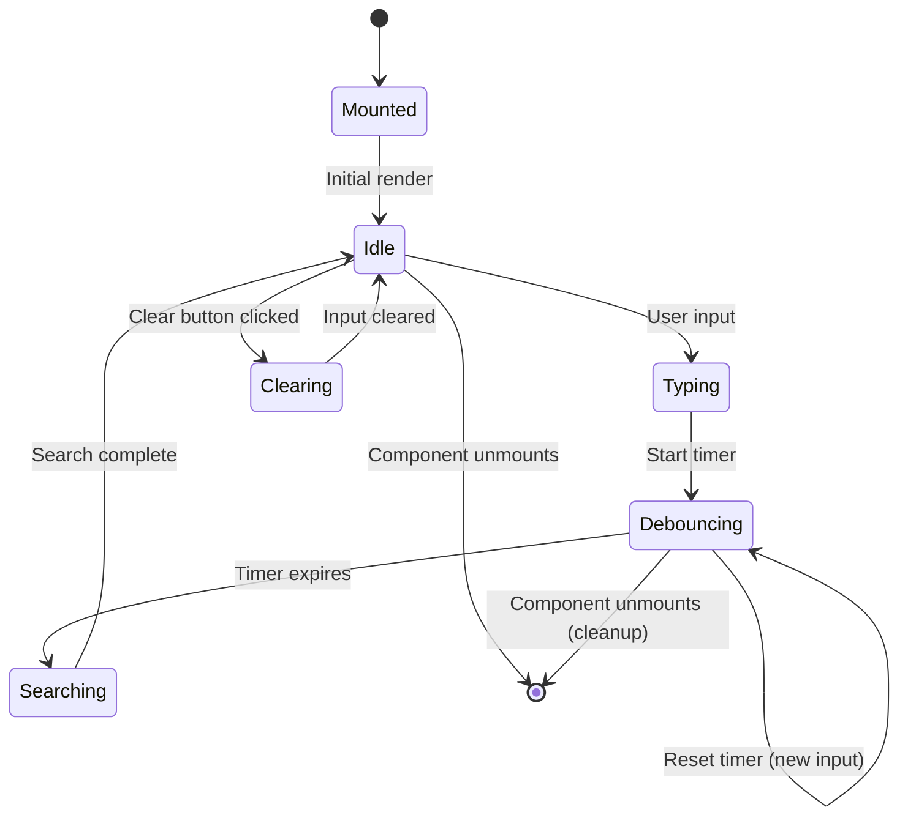
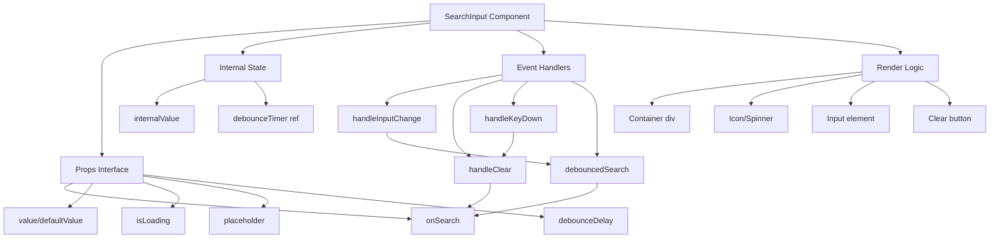

# Design Document: Consistent Search Input Component

## Overview

This design document specifies a unified, reusable search input component that will replace 21 existing search implementations across the application. The component provides consistent visual design, debounced search execution, loading states, clear button functionality, keyboard shortcuts, and full accessibility compliance.

### Design Goals

1. **Consistency**: Ensure identical visual appearance and behavior across all search instances
2. **Reusability**: Single component that adapts to different contexts through props
3. **Performance**: Optimized debouncing, memoization, and cleanup to prevent memory leaks
4. **Accessibility**: Full WCAG compliance with screen reader support and keyboard navigation
5. **Developer Experience**: Simple API that supports both controlled and uncontrolled modes

### Key Design Decisions

- **React Component**: Built as a TypeScript React component for type safety
- **Controlled/Uncontrolled Flexibility**: Supports both patterns for different state management needs
- **Debounce by Default**: 300ms default delay balances responsiveness with performance
- **Visual Consistency**: Fixed dimensions and styling based on existing design system
- **Composition over Configuration**: Simple prop interface with sensible defaults

## Architecture

### Component Structure

```
SearchInput (Main Component)
├── Container (div with border, padding, flex layout)
├── Icon Slot (Search icon or Loading spinner)
├── Input Element (native HTML input)
└── Clear Button (conditionally rendered)
```

### State Management

The component supports two modes:

1. **Controlled Mode**: Parent manages value via `value` and `onChange` props
2. **Uncontrolled Mode**: Component manages internal state with `defaultValue`

Internal state includes:

- `internalValue`: Current input text (uncontrolled mode only)
- `debounceTimer`: Reference to active debounce timeout

### Data Flow

```
User Input → Local State Update → Debounce Timer → Search Handler Invocation
                                                  ↓
                                            Parent Component
```

## Components and Interfaces

### SearchInput Component API

```typescript
interface SearchInputProps {
  // Search behavior
  onSearch: (query: string) => void;
  placeholder?: string;
  debounceDelay?: number;

  // Controlled mode
  value?: string;
  onChange?: (value: string) => void;

  // Uncontrolled mode
  defaultValue?: string;

  // Visual state
  isLoading?: boolean;
  error?: string;

  // Accessibility
  ariaLabel?: string;
  ariaDescribedBy?: string;

  // Customization
  maxLength?: number;
  disabled?: boolean;
  className?: string;

  // Callbacks
  onClear?: () => void;
  onError?: (error: Error) => void;
  onFocus?: () => void;
  onBlur?: () => void;
}
```

### Component Behavior Specification

**Controlled vs Uncontrolled Mode Detection**:

- If `value` prop is provided → Controlled mode
- If `value` prop is undefined → Uncontrolled mode
- `defaultValue` only used in uncontrolled mode

**Debounce Behavior**:

- Timer starts on each keystroke
- Previous timer cancelled on new keystroke
- Timer cleared on component unmount
- Timer cleared when clear button clicked

**Loading State Behavior**:

- When `isLoading={true}`: Show spinner, hide search icon
- When `isLoading={false}`: Show search icon, hide spinner
- Loading state does not disable input

**Clear Button Behavior**:

- Visible when: `value.length > 0 && !isLoading`
- On click: Clear input, invoke `onSearch("")`, invoke `onClear()` if provided
- Keyboard accessible with proper ARIA label

### Visual Design Specifications

Based on analysis of existing implementations, the component uses these specifications:

**Dimensions**:

- Height: `38px`
- Padding: `12px` horizontal, `7px` vertical
- Border radius: `8px`
- Border width: `1px`

**Colors**:

- Border: `#E1E4EA` (default), `#FF0000` (error state)
- Background: `transparent` (default), `#FEF2F2` (error state)
- Text: `#000000` (13px, Inter Tight font)
- Placeholder: `rgba(0, 0, 0, 0.3)`
- Icon color: `#B2B2B2`
- Clear button hover: `#000000`

**Spacing**:

- Gap between icon and input: `6px`
- Icon size: `15px × 15px`
- Spinner size: `15px × 15px`

**Typography**:

- Font family: `Inter Tight`
- Font size: `13px`
- Font weight: `400` (normal)
- Line height: normal

**Focus State**:

- Outline: Browser default focus ring
- No custom focus styling to maintain accessibility

**Transitions**:

- Color transitions: `150ms ease`
- Opacity transitions: `150ms ease`

### Icon Components

**Search Icon** (from lucide-react):

```typescript
<Search className="w-[15px] h-[15px] text-[#B2B2B2] flex-shrink-0" />
```

**Loading Spinner**:

```typescript
<div className="w-[15px] h-[15px] border-2 border-[#B2B2B2] border-t-transparent rounded-full animate-spin flex-shrink-0" />
```

**Clear Button Icon** (from lucide-react):

```typescript
<X className="w-[15px] h-[15px]" />
```

## Data Models

### Internal State Model

```typescript
interface SearchInputState {
  // Current value (uncontrolled mode only)
  internalValue: string;

  // Debounce timer reference
  debounceTimer: NodeJS.Timeout | null;
}
```

### Props Validation Rules

1. **Mutually Exclusive Props**: Cannot provide both `value` and `defaultValue`
2. **Debounce Delay**: Must be non-negative number, defaults to 300
3. **Max Length**: Must be positive integer if provided
4. **Callbacks**: All callback props must be functions or undefined

### Component Lifecycle



### Error Handling Model

The component handles errors gracefully:

1. **Search Handler Errors**: Caught and passed to `onError` callback if provided
2. **Invalid Props**: Component logs warnings in development mode
3. **Cleanup Failures**: Silently handled to prevent crashes

## Correctness Properties

_A property is a characteristic or behavior that should hold true across all valid executions of a system—essentially, a formal statement about what the system should do. Properties serve as the bridge between human-readable specifications and machine-verifiable correctness guarantees._

### Property Reflection

After analyzing all acceptance criteria, I identified several areas of redundancy:

1. **Placeholder properties (1.2, 12.1, 12.2, 12.3, 12.4)**: Combined into comprehensive placeholder property
2. **Clear button behavior (5.3, 5.4)**: Combined into single clear action property
3. **Escape key behavior (6.1, 6.2)**: Combined into single keyboard shortcut property
4. **Controlled mode properties (8.1, 8.3)**: Combined into single controlled mode property
5. **Visual consistency properties (2.1, 2.2, 2.3)**: Combined into single styling property
6. **Debounce properties (3.1, 3.2, 3.4)**: Combined into comprehensive debounce property
7. **Performance properties (11.2, 11.3)**: Combined into single memoization property

### Property 1: Placeholder Text Rendering

_For any_ string provided as placeholder text, the component SHALL render that text in the input field with consistent styling (rgba(0,0,0,0.3) color, 13px Inter Tight font), and when no placeholder is provided, SHALL default to "Search...".

**Validates: Requirements 1.2, 12.2, 12.3, 12.4**

### Property 2: Initial Value Display

_For any_ string provided as defaultValue or value prop, the component SHALL display that exact string in the input field on initial render.

**Validates: Requirements 1.3**

### Property 3: Debounce Delay Configuration

_For any_ non-negative number provided as debounceDelay, the component SHALL wait exactly that many milliseconds before invoking onSearch, and when no delay is provided, SHALL default to 300ms.

**Validates: Requirements 1.4, 3.3, 3.4**

### Property 4: Value Exposure to Parent

_For any_ input change in controlled mode, the component SHALL invoke onChange with the exact current input value.

**Validates: Requirements 1.6**

### Property 5: Consistent Visual Styling

_For any_ instance of the component, the rendered container SHALL have height of 38px, padding of 12px horizontal and 7px vertical, border radius of 8px, border color of #E1E4EA, and the input text SHALL use 13px Inter Tight font.

**Validates: Requirements 2.1, 2.2, 2.3**

### Property 6: Focus State Visibility

_For any_ component instance, when the input receives focus, the component SHALL display a visible focus indicator that meets accessibility standards.

**Validates: Requirements 2.5**

### Property 7: Debounce Timer Reset

_For any_ sequence of rapid input changes, the component SHALL cancel previous timers and only invoke onSearch once after the final input, waiting the full debounce delay from the last keystroke.

**Validates: Requirements 3.1, 3.2**

### Property 8: Clear Button Visibility

_For any_ non-empty input value when not loading, the component SHALL display a clear button, and for any empty input value, SHALL hide the clear button.

**Validates: Requirements 5.1, 5.2**

### Property 9: Clear Button Action

_For any_ input value, when the clear button is clicked, the component SHALL set the input to empty string AND invoke onSearch("") AND invoke onClear() if provided.

**Validates: Requirements 5.3, 5.4**

### Property 10: Escape Key Clears Input

_For any_ non-empty input value, when the Escape key is pressed while the input has focus, the component SHALL clear the input text AND invoke onSearch("").

**Validates: Requirements 6.1, 6.2**

### Property 11: Accessible Label Presence

_For any_ component instance, the input element SHALL have either an aria-label attribute or an associated label element.

**Validates: Requirements 7.1**

### Property 12: Conditional Aria Attributes

_For any_ component instance where ariaDescribedBy prop is provided, the input element SHALL have an aria-describedby attribute with that value.

**Validates: Requirements 7.2**

### Property 13: Keyboard Navigation

_For any_ component instance, all interactive elements (input, clear button) SHALL be reachable and operable using only keyboard navigation (Tab, Enter, Escape).

**Validates: Requirements 7.6**

### Property 14: Controlled Mode Behavior

_For any_ component instance where a value prop is provided, the input SHALL always display that value and SHALL invoke onChange on every input change, never managing its own internal state.

**Validates: Requirements 8.1, 8.3**

### Property 15: Uncontrolled Mode Behavior

_For any_ component instance where no value prop is provided, the component SHALL manage its own internal state and SHALL still invoke onSearch after the debounce delay.

**Validates: Requirements 8.2, 8.4**

### Property 16: Error Resilience

_For any_ onSearch function that throws an error, the component SHALL catch the error, continue functioning, invoke onError callback if provided, and exit loading state.

**Validates: Requirements 10.1, 10.2, 10.3**

### Property 17: Invalid Props Handling

_For any_ invalid prop values (negative debounce, non-function callbacks), the component SHALL not crash and SHALL log warnings in development mode.

**Validates: Requirements 10.4**

### Property 18: Timer Cleanup on Unmount

_For any_ component instance with an active debounce timer, when the component unmounts, the timer SHALL be cleared and SHALL not invoke onSearch.

**Validates: Requirements 11.1**

### Property 19: Callback Memoization

_For any_ component instance, internal callback functions SHALL maintain referential equality across renders when their dependencies have not changed.

**Validates: Requirements 11.2, 11.3**

### Property 20: Selective Re-rendering

_For any_ prop change that does not affect the component's output (e.g., unrelated parent state), the component SHALL not re-render.

**Validates: Requirements 11.4**

## Error Handling

### Error Categories and Handling Strategies

**1. Search Handler Errors**

When `onSearch` throws an error:

- Catch error in try-catch block
- Invoke `onError(error)` callback if provided
- Set loading state to false
- Log error to console in development mode
- Component remains functional for subsequent searches

```typescript
try {
  await onSearch(query);
} catch (error) {
  setIsLoading(false);
  onError?.(error as Error);
  if (process.env.NODE_ENV === "development") {
    console.error("SearchInput: Search handler error:", error);
  }
}
```

**2. Invalid Props**

When invalid props are provided:

- Use default values for invalid numeric props (e.g., negative debounce → 300ms)
- Log warnings in development mode
- Component continues to render with safe defaults
- TypeScript types prevent most invalid props at compile time

**3. Cleanup Failures**

When timer cleanup fails:

- Silently handle cleanup errors
- Prevent error propagation to parent
- Ensure component can still unmount

**4. Controlled/Uncontrolled Mode Conflicts**

When both `value` and `defaultValue` are provided:

- Prioritize `value` (controlled mode)
- Log warning in development mode
- Ignore `defaultValue`

### Error Boundaries

The component does not implement its own error boundary. Parent components should wrap SearchInput in an error boundary if needed for critical search functionality.

### Accessibility Error States

When `error` prop is provided:

- Apply error styling (red border, red background tint)
- Display error message below input
- Link error message with `aria-describedby`
- Maintain keyboard accessibility in error state

## Testing Strategy

### Dual Testing Approach

This component requires both unit tests and property-based tests for comprehensive coverage:

**Unit Tests**: Focus on specific examples, edge cases, and integration points
**Property Tests**: Verify universal properties across all inputs using randomization

Unit tests are helpful for concrete scenarios, but we should avoid writing too many. Property-based tests handle covering lots of inputs automatically.

### Property-Based Testing

**Library**: `@fast-check/vitest` (for TypeScript/React projects)

**Configuration**:

- Minimum 100 iterations per property test
- Each test tagged with reference to design document property
- Tag format: `Feature: consistent-search-input, Property {number}: {property_text}`

**Property Test Coverage**:

1. **Property 1 (Placeholder)**: Generate random strings, verify rendering and styling
2. **Property 2 (Initial Value)**: Generate random initial values, verify display
3. **Property 3 (Debounce Delay)**: Generate random delays, verify timing with fake timers
4. **Property 4 (Value Exposure)**: Generate random inputs, verify onChange calls
5. **Property 5 (Visual Styling)**: Verify consistent CSS across random prop combinations
6. **Property 6 (Focus State)**: Verify focus indicators across random states
7. **Property 7 (Debounce Reset)**: Generate random input sequences, verify single call
8. **Property 8 (Clear Button Visibility)**: Generate random values, verify visibility logic
9. **Property 9 (Clear Action)**: Generate random values, verify clear behavior
10. **Property 10 (Escape Key)**: Generate random values, verify escape behavior
11. **Property 11 (Accessible Label)**: Verify label presence across random props
12. **Property 12 (Conditional Aria)**: Generate random ariaDescribedBy values
13. **Property 13 (Keyboard Nav)**: Verify keyboard accessibility across states
14. **Property 14 (Controlled Mode)**: Generate random controlled values
15. **Property 15 (Uncontrolled Mode)**: Generate random uncontrolled scenarios
16. **Property 16 (Error Resilience)**: Generate random errors, verify handling
17. **Property 17 (Invalid Props)**: Generate invalid props, verify no crash
18. **Property 18 (Timer Cleanup)**: Verify cleanup across random unmount scenarios
19. **Property 19 (Memoization)**: Verify callback stability across renders
20. **Property 20 (Re-rendering)**: Verify selective re-renders with random props

### Unit Testing

**Focus Areas**:

1. **Specific Examples**:
   - Default placeholder "Search..." appears when no placeholder provided
   - Default debounce delay is 300ms
   - Loading spinner appears when isLoading=true
   - Search icon hidden when isLoading=true
   - Clear button has aria-label="Clear search"

2. **Edge Cases**:
   - Empty string input
   - Very long input strings (maxLength enforcement)
   - Rapid typing followed by immediate unmount
   - Switching between controlled and uncontrolled mode
   - Multiple simultaneous clear actions

3. **Integration Points**:
   - Component works with React Testing Library
   - Component works with different state management patterns
   - Component integrates with form libraries
   - Component works with CSS-in-JS solutions

4. **Error Conditions**:
   - onSearch throws synchronous error
   - onSearch throws asynchronous error
   - Invalid debounce delay (negative number)
   - Missing required props

**Testing Tools**:

- Vitest for test runner
- React Testing Library for component testing
- @testing-library/user-event for user interactions
- @fast-check/vitest for property-based testing
- jest-dom for DOM assertions

### Visual Regression Testing

Consider adding visual regression tests for:

- Default state
- Loading state
- Error state
- Focus state
- With clear button visible
- Different placeholder lengths

### Accessibility Testing

Use `@testing-library/jest-dom` and `axe-core` to verify:

- No accessibility violations in default state
- Proper ARIA attributes
- Keyboard navigation works
- Screen reader announcements
- Color contrast ratios

### Performance Testing

Monitor:

- Render time with React DevTools Profiler
- Memory leaks with Chrome DevTools
- Debounce timer cleanup
- Re-render frequency with different prop patterns

### Migration Testing

Create tests that verify the new component can replace existing implementations:

- Test with props matching search-bar.tsx patterns
- Test with props matching DiscoverTalentHeader.tsx patterns
- Test with props matching SearchAndFilters.tsx patterns
- Verify visual parity with screenshots

## Migration Strategy

### Migration Phases

**Phase 1: Component Creation**

1. Create SearchInput component in `components/ui/search-input.tsx`
2. Implement all core functionality
3. Write comprehensive tests
4. Document component API

**Phase 2: Pilot Migration**

1. Migrate 2-3 low-risk search implementations
2. Gather feedback from team
3. Refine component based on real-world usage
4. Update documentation with migration examples

**Phase 3: Bulk Migration**

1. Migrate remaining 18 implementations
2. Remove deprecated search components
3. Update design system documentation
4. Create migration guide for future developers

### Migration Patterns

**Pattern 1: Simple Search (search-bar.tsx style)**

Before:

```typescript
<div className="flex items-center gap-[6px]">
  <Search className="w-[15px] h-[15px]" />
  <input
    type="text"
    placeholder="Search opportunities..."
    value={searchQuery}
    onChange={(e) => onSearchChange(e.target.value)}
  />
</div>
```

After:

```typescript
<SearchInput
  value={searchQuery}
  onChange={onSearchChange}
  onSearch={handleSearch}
  placeholder="Search opportunities..."
/>
```

**Pattern 2: With Debouncing (DiscoverTalentHeader.tsx style)**

Before:

```typescript
const [localSearchQuery, setLocalSearchQuery] = useState(searchQuery);
const debounceTimer = useRef<NodeJS.Timeout>();

const handleSearchChange = (value: string) => {
  setLocalSearchQuery(value);
  if (debounceTimer.current) {
    clearTimeout(debounceTimer.current);
  }
  debounceTimer.current = setTimeout(() => {
    onSearchChange(value);
  }, 300);
};
```

After:

```typescript
<SearchInput
  onSearch={onSearchChange}
  placeholder="Search talents..."
  debounceDelay={300}
/>
```

**Pattern 3: With Loading State**

Before:

```typescript
{isLoading ? (
  <div className="animate-spin..." />
) : (
  <Search className="w-[15px] h-[15px]" />
)}
```

After:

```typescript
<SearchInput
  onSearch={handleSearch}
  isLoading={isLoading}
  placeholder="Search..."
/>
```

### Breaking Changes

None expected. The component is designed to be additive, not replacing existing patterns immediately.

### Rollback Plan

If critical issues are discovered:

1. Keep old implementations in codebase temporarily
2. Revert specific migrations that cause problems
3. Fix issues in SearchInput component
4. Re-migrate after fixes are verified

### Success Metrics

- All 21 search implementations replaced
- Zero accessibility regressions
- Consistent visual appearance across all instances
- No performance degradation
- Positive developer feedback on API usability

## Implementation Notes

### Technology Stack

- **React**: 18.x or higher (for concurrent features)
- **TypeScript**: 5.x for type safety
- **Tailwind CSS**: For styling consistency
- **lucide-react**: For icons (Search, X)
- **React hooks**: useState, useRef, useCallback, useEffect, useMemo

### Key Implementation Details

**1. Controlled vs Uncontrolled Detection**

```typescript
const isControlled = value !== undefined;
const [internalValue, setInternalValue] = useState(defaultValue || "");
const currentValue = isControlled ? value : internalValue;
```

**2. Debounce Implementation**

```typescript
const debounceTimerRef = useRef<NodeJS.Timeout>();

const debouncedSearch = useCallback(
  (query: string) => {
    if (debounceTimerRef.current) {
      clearTimeout(debounceTimerRef.current);
    }

    debounceTimerRef.current = setTimeout(() => {
      try {
        onSearch(query);
      } catch (error) {
        onError?.(error as Error);
      }
    }, debounceDelay);
  },
  [onSearch, debounceDelay, onError],
);

// Cleanup on unmount
useEffect(() => {
  return () => {
    if (debounceTimerRef.current) {
      clearTimeout(debounceTimerRef.current);
    }
  };
}, []);
```

**3. Memoization Strategy**

```typescript
const handleInputChange = useCallback(
  (e: React.ChangeEvent<HTMLInputElement>) => {
    const newValue = e.target.value;

    if (!isControlled) {
      setInternalValue(newValue);
    }

    onChange?.(newValue);
    debouncedSearch(newValue);
  },
  [isControlled, onChange, debouncedSearch],
);

const handleClear = useCallback(() => {
  const emptyValue = "";

  if (!isControlled) {
    setInternalValue(emptyValue);
  }

  onChange?.(emptyValue);
  onSearch(emptyValue);
  onClear?.();
}, [isControlled, onChange, onSearch, onClear]);
```

**4. Keyboard Event Handling**

```typescript
const handleKeyDown = useCallback(
  (e: React.KeyboardEvent<HTMLInputElement>) => {
    if (e.key === "Escape" && currentValue) {
      e.preventDefault();
      handleClear();
    }
  },
  [currentValue, handleClear],
);
```

**5. Accessibility Attributes**

```typescript
<input
  type="text"
  value={currentValue}
  onChange={handleInputChange}
  onKeyDown={handleKeyDown}
  placeholder={placeholder || 'Search...'}
  disabled={disabled}
  maxLength={maxLength}
  aria-label={ariaLabel || 'Search'}
  aria-describedby={ariaDescribedBy}
  aria-busy={isLoading}
  className={inputClassName}
/>
```

### Component File Structure

```
components/ui/
├── search-input.tsx          # Main component
├── search-input.test.tsx     # Unit tests
└── search-input.spec.tsx     # Property-based tests
```

### Performance Considerations

1. **Memoization**: Use `useCallback` for all event handlers
2. **Ref Usage**: Use `useRef` for timer to avoid re-renders
3. **Conditional Rendering**: Only render clear button when needed
4. **CSS**: Use Tailwind classes for optimal performance
5. **Bundle Size**: Component should be < 5KB gzipped

### Browser Compatibility

- Chrome 90+
- Firefox 88+
- Safari 14+
- Edge 90+

### Dependencies

```json
{
  "dependencies": {
    "react": "^18.0.0",
    "lucide-react": "^0.263.0"
  },
  "devDependencies": {
    "@testing-library/react": "^14.0.0",
    "@testing-library/user-event": "^14.0.0",
    "@fast-check/vitest": "^0.0.8",
    "vitest": "^1.0.0"
  }
}
```

### Component Architecture Diagram



### Code Quality Standards

- **TypeScript**: Strict mode enabled, no `any` types
- **ESLint**: Follow project ESLint configuration
- **Prettier**: Auto-format on save
- **Test Coverage**: Minimum 90% coverage
- **Documentation**: JSDoc comments for all props
- **Accessibility**: Pass axe-core audits with zero violations
