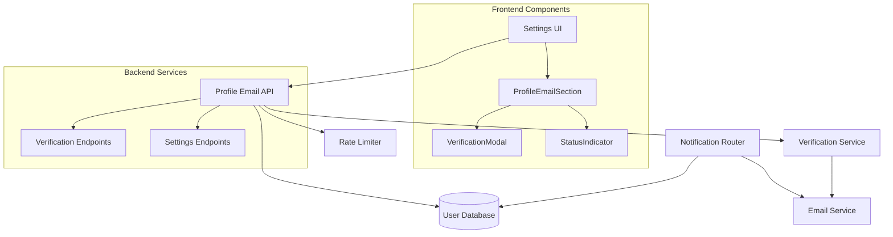

# Design Document: Profile Email Customization

## Overview

This feature enables users to set different email addresses for each of their profiles (Talent, Mentor, Recruiter) while maintaining their main account email for login and account management. The system provides email verification, rate limiting, and intelligent notification routing to ensure reliable communication while preventing abuse.

### Key Capabilities

- **Profile-Specific Emails**: Users can set unique email addresses for each role
- **Email Verification**: 6-digit verification codes ensure email ownership
- **Rate Limiting**: 7-day cooldown prevents abuse and reduces verification volume
- **Smart Routing**: Notifications use verified profile emails with fallback to main account email
- **Responsive UI**: Mobile-friendly interface integrated into existing settings pages

### User Experience Flow

1. User navigates to role-specific settings page
2. User sees new "Profile Email" section with current status
3. User enters new email address for the profile
4. System sends 6-digit verification code to new email
5. User enters verification code in modal/inline form
6. System verifies code and activates profile email
7. Future notifications for that role use the verified email

## Architecture

### System Components



### Data Flow

1. **Email Update Flow**:
   - User submits new email → Rate limit check → Validation → Database update → Verification code sent
   
2. **Verification Flow**:
   - User submits code → Code validation → Email marked as verified → UI updated
   
3. **Notification Flow**:
   - Notification triggered → Router checks profile email status → Uses verified profile email or falls back to main account email

### Integration Points

- **Existing Settings Pages**: Extends current TalentSettings, MentorSettings, EmployerSettings components
- **API Layer**: Integrates with existing `/talent/settings`, `/mentor/settings`, `/recruiter/settings` endpoints
- **Verification System**: Uses existing verification endpoints pattern
- **Notification System**: Extends current notification routing logic

## Components and Interfaces

### Frontend Components

#### ProfileEmailSection Component

**Purpose**: Reusable component for managing profile-specific email settings

**Props Interface**:
```typescript
interface ProfileEmailSectionProps {
  role: 'talent' | 'mentor' | 'recruiter';
  currentEmail?: string;
  emailVerified: boolean;
  emailUpdatedAt?: string;
  mainAccountEmail: string;
  onEmailUpdate: (email: string) => Promise<void>;
  onVerifyEmail: (code: string) => Promise<void>;
  onResendCode: () => Promise<void>;
  isLoading?: boolean;
  rateLimitedUntil?: string;
}
```

**Key Features**:
- Email input with validation
- Status indicators (verified, pending, using main email)
- Rate limiting UI states
- Verification code input (conditional)
- Responsive design for mobile

#### VerificationModal Component

**Purpose**: Modal for email verification code entry

**Props Interface**:
```typescript
interface VerificationModalProps {
  isOpen: boolean;
  onClose: () => void;
  onVerify: (code: string) => Promise<void>;
  onResendCode: () => Promise<void>;
  email: string;
  isLoading?: boolean;
  error?: string;
}
```

**Features**:
- 6-digit code input with auto-focus
- Resend code functionality
- Error handling and display
- Auto-close on successful verification

#### StatusIndicator Component

**Purpose**: Visual indicator for email verification status

**Props Interface**:
```typescript
interface StatusIndicatorProps {
  status: 'verified' | 'pending' | 'main-email' | 'rate-limited';
  nextUpdateTime?: string;
}
```

### Backend API Extensions

#### Settings Endpoints Enhancement

**Existing Endpoints Extended**:
- `GET /talent/settings` → Add email fields
- `PATCH /talent/settings` → Add email update logic
- `GET /mentor/settings` → Add email fields  
- `PATCH /mentor/settings` → Add email update logic
- `GET /recruiter/settings` → Add email fields
- `PATCH /recruiter/settings` → Add email update logic

**New Response Fields**:
```typescript
interface EnhancedSettings {
  // Existing fields...
  
  // New email fields
  email?: string;
  emailVerified: boolean;
  emailUpdatedAt?: string;
}
```

#### Verification Endpoints

**Existing Endpoints Used**:
- `POST /talent/verify-email`
- `POST /mentor/verify-email`
- `POST /recruiter/verify-email`

**Request/Response Format**:
```typescript
// Request
interface VerifyEmailRequest {
  code: string;
}

// Response
interface VerifyEmailResponse {
  success: boolean;
  message?: string;
}
```

### API Service Functions

#### New Service Functions

```typescript
// lib/api/talent/index.ts additions
export async function updateTalentEmail(email: string): Promise<TalentSettings>;
export async function verifyTalentEmail(code: string): Promise<VerifyEmailResponse>;
export async function resendTalentVerification(): Promise<void>;

// lib/api/mentor/index.ts additions  
export async function updateMentorEmail(email: string): Promise<MentorSettings>;
export async function verifyMentorEmail(code: string): Promise<VerifyEmailResponse>;
export async function resendMentorVerification(): Promise<void>;

// lib/api/recruiter/index.ts additions
export async function updateRecruiterEmail(email: string): Promise<RecruiterSettings>;
export async function verifyRecruiterEmail(code: string): Promise<VerifyEmailResponse>;
export async function resendRecruiterVerification(): Promise<void>;
```

## Data Models

### Database Schema Extensions

#### User Settings Tables

**Talent Settings Extension**:
```sql
ALTER TABLE talent_settings ADD COLUMN email VARCHAR(255);
ALTER TABLE talent_settings ADD COLUMN email_verified BOOLEAN DEFAULT FALSE;
ALTER TABLE talent_settings ADD COLUMN email_updated_at TIMESTAMP;
ALTER TABLE talent_settings ADD COLUMN email_verification_code VARCHAR(6);
ALTER TABLE talent_settings ADD COLUMN verification_code_expires_at TIMESTAMP;
```

**Mentor Settings Extension**:
```sql
ALTER TABLE mentor_settings ADD COLUMN email VARCHAR(255);
ALTER TABLE mentor_settings ADD COLUMN email_verified BOOLEAN DEFAULT FALSE;
ALTER TABLE mentor_settings ADD COLUMN email_updated_at TIMESTAMP;
ALTER TABLE mentor_settings ADD COLUMN email_verification_code VARCHAR(6);
ALTER TABLE mentor_settings ADD COLUMN verification_code_expires_at TIMESTAMP;
```

**Recruiter Settings Extension**:
```sql
ALTER TABLE recruiter_settings ADD COLUMN email VARCHAR(255);
ALTER TABLE recruiter_settings ADD COLUMN email_verified BOOLEAN DEFAULT FALSE;
ALTER TABLE recruiter_settings ADD COLUMN email_updated_at TIMESTAMP;
ALTER TABLE recruiter_settings ADD COLUMN email_verification_code VARCHAR(6);
ALTER TABLE recruiter_settings ADD COLUMN verification_code_expires_at TIMESTAMP;
```

### TypeScript Type Extensions

#### Settings Types

```typescript
// lib/api/talent/types.ts
export interface TalentSettings {
  // Existing fields...
  profileVisible: boolean;
  emailApplications: boolean;
  emailInterviews: boolean;
  emailMarketing: boolean;
  pushApplications: boolean;
  pushInterviews: boolean;
  
  // New email fields
  email?: string;
  emailVerified: boolean;
  emailUpdatedAt?: string;
}

// lib/api/mentor/types.ts
export interface MentorSettings {
  // Existing fields...
  sessionDuration: number;
  // ... other existing fields
  
  // New email fields
  email?: string;
  emailVerified: boolean;
  emailUpdatedAt?: string;
}

// lib/api/recruiter/types.ts  
export interface RecruiterSettings {
  // Existing fields...
  
  // New email fields
  email?: string;
  emailVerified: boolean;
  emailUpdatedAt?: string;
}
```

#### Verification Types

```typescript
// lib/api/types.ts
export interface VerifyEmailRequest {
  code: string;
}

export interface VerifyEmailResponse {
  success: boolean;
  message?: string;
}

export interface EmailUpdateRequest {
  email: string;
}

export interface RateLimitError {
  error: 'RATE_LIMITED';
  message: string;
  nextAllowedUpdate: string; // ISO timestamp
}
```

### Validation Rules

#### Email Validation
- Must be valid email format (RFC 5322 compliant)
- Maximum length: 255 characters
- Cannot be duplicate across users
- Cannot be duplicate within user's profiles
- Must be different from main account email

#### Rate Limiting Rules
- One email update per profile per 7 days
- Independent tracking per role (talent/mentor/recruiter)
- Cooldown starts from successful email update
- Rate limit persists even if verification fails

#### Verification Code Rules
- 6-digit numeric code
- 15-minute expiration
- Maximum 5 attempts per code
- New code invalidates previous code
- Temporary lockout after 5 failed attempts
## Correctness Properties

*A property is a characteristic or behavior that should hold true across all valid executions of a system-essentially, a formal statement about what the system should do. Properties serve as the bridge between human-readable specifications and machine-verifiable correctness guarantees.*

After analyzing the acceptance criteria, I've identified properties that can be combined to eliminate redundancy while maintaining comprehensive coverage:

### Property Reflection

Several properties can be consolidated:
- Notification routing properties (4.1, 4.2, 4.3) can be combined into a single comprehensive property
- Email validation and security properties (6.1, 6.2, 6.3) can be unified
- UI status display properties (1.4, 5.2) overlap and can be merged
- Rate limiting properties (3.1, 3.2, 3.3) can be consolidated

### Property 1: Profile Email Storage and Retrieval

*For any* user and any role (talent, mentor, recruiter), when a unique email address is set for that profile, the system should store it independently and retrieve it correctly without affecting the main account email or other profile emails.

**Validates: Requirements 1.1, 1.2, 8.1, 8.3**

### Property 2: Email Update Verification Reset

*For any* profile email update, the system should mark the email as unverified and require verification before the email becomes active for notifications.

**Validates: Requirements 1.3, 2.1**

### Property 3: Verification Code Generation and Validation

*For any* email verification request, the system should generate a 6-digit numeric code that expires after 15 minutes, and valid codes should mark emails as verified while invalid codes should return appropriate errors.

**Validates: Requirements 2.2, 2.3, 2.4, 2.5**

### Property 4: Rate Limiting Enforcement

*For any* profile (talent, mentor, recruiter), the system should allow email updates only once every 7 days per profile independently, and attempts to update before the cooldown expires should return an error with the remaining wait time.

**Validates: Requirements 3.1, 3.2, 3.3**

### Property 5: Notification Routing Logic

*For any* notification and any role, the system should use the verified profile email if available, otherwise fall back to the main account email, except for account management notifications which should always use the main account email.

**Validates: Requirements 2.6, 4.1, 4.2, 4.3, 4.4**

### Property 6: Email Validation and Uniqueness

*For any* email address, the system should validate the format, prevent duplicates across different users, prevent duplicates within the same user's profiles, and sanitize input to prevent injection attacks.

**Validates: Requirements 6.1, 6.2, 6.3, 6.5**

### Property 7: UI Status Display Accuracy

*For any* profile email state (verified, unverified, using main email, rate limited), the UI should display the correct status indicators and show verification code input when needed.

**Validates: Requirements 1.4, 1.5, 5.2, 5.3, 5.6**

### Property 8: Error Handling and Fallback Behavior

*For any* system failure (invalid emails, unavailable services, delivery failures), the system should provide appropriate error messages, queue requests for retry when possible, and fall back to the main account email for notifications.

**Validates: Requirements 6.4, 7.1, 7.2, 7.3, 7.4**

### Property 9: Verification Attempt Rate Limiting

*For any* email address, after multiple failed verification attempts, the system should temporarily disable further verification attempts and provide appropriate error messaging.

**Validates: Requirements 7.5**

### Property 10: API Integration and Compatibility

*For any* settings retrieval or update, the system should integrate with existing role-based endpoints, use existing verification endpoints, and maintain backward compatibility with existing notification systems.

**Validates: Requirements 8.2, 8.4, 8.5**

### Property 11: Toast Notification Feedback

*For any* user action (successful email update, verification success, errors), the system should display appropriate toast notifications to provide user feedback.

**Validates: Requirements 5.4, 7.4**

### Property 12: Notification Logging

*For any* notification sent, the system should log which email address was used and log failures for administrative review.

**Validates: Requirements 4.5, 7.3**

## Error Handling

### Client-Side Error Handling

#### Network Errors
- **Connection Failures**: Display "Unable to connect. Please check your internet connection."
- **Timeout Errors**: Show retry option with exponential backoff
- **Server Errors (5xx)**: Display "Server error. Please try again later."

#### Validation Errors
- **Invalid Email Format**: "Please enter a valid email address"
- **Duplicate Email**: "This email is already in use. Please choose a different email."
- **Rate Limited**: "You can update this email again on [date]. Next update available in [time remaining]."

#### Verification Errors
- **Invalid Code**: "Invalid verification code. Please check and try again."
- **Expired Code**: "Verification code has expired. Please request a new code."
- **Too Many Attempts**: "Too many failed attempts. Please try again in 15 minutes."

### Server-Side Error Handling

#### Database Errors
- **Connection Issues**: Queue requests for retry, return temporary error to client
- **Constraint Violations**: Return specific error messages for duplicates
- **Transaction Failures**: Rollback changes, return appropriate error

#### External Service Errors
- **Email Service Down**: Queue verification emails for retry
- **Rate Limiting Service Down**: Allow updates but log for manual review
- **Verification Service Down**: Queue verification requests

#### Security Errors
- **Injection Attempts**: Log security event, sanitize input, return generic error
- **Suspicious Activity**: Implement temporary lockouts, alert administrators

### Fallback Strategies

#### Email Delivery Failures
1. **Profile Email Bounce**: Automatically fall back to main account email
2. **Main Account Email Bounce**: Log for administrative intervention
3. **Both Emails Fail**: Queue for manual review and alternative contact methods

#### Service Unavailability
1. **Verification Service Down**: Allow email updates but mark as pending verification
2. **Database Issues**: Use cached data where possible, queue updates
3. **Rate Limiting Service Down**: Allow updates but log for post-incident review

## Testing Strategy

### Dual Testing Approach

The testing strategy employs both unit tests and property-based tests to ensure comprehensive coverage:

- **Unit Tests**: Focus on specific examples, edge cases, and integration points
- **Property Tests**: Verify universal properties across all possible inputs
- **Integration Tests**: Validate component interactions and API integrations

### Unit Testing Focus Areas

#### Component Testing
- **ProfileEmailSection**: Test rendering states, user interactions, and prop handling
- **VerificationModal**: Test code input, validation, and modal behavior
- **StatusIndicator**: Test different status displays and responsive behavior

#### API Integration Testing
- **Settings Endpoints**: Test email field additions to existing endpoints
- **Verification Endpoints**: Test code generation, validation, and expiration
- **Error Handling**: Test network failures, validation errors, and rate limiting

#### Edge Cases and Error Conditions
- **Network Failures**: Test offline scenarios and connection timeouts
- **Invalid Inputs**: Test malformed emails, injection attempts, and boundary conditions
- **Rate Limiting**: Test cooldown periods and edge cases around timing
- **Verification Expiration**: Test code expiration and cleanup

### Property-Based Testing Configuration

**Testing Library**: Use `fast-check` for TypeScript/JavaScript property-based testing

**Test Configuration**:
- Minimum 100 iterations per property test
- Custom generators for email addresses, verification codes, and timestamps
- Shrinking enabled to find minimal failing examples

**Property Test Tags**:
Each property test must include a comment referencing the design document property:

```typescript
// Feature: profile-email-customization, Property 1: Profile Email Storage and Retrieval
test('profile email storage and retrieval property', () => {
  fc.assert(fc.property(
    fc.emailAddress(),
    fc.constantFrom('talent', 'mentor', 'recruiter'),
    (email, role) => {
      // Test implementation
    }
  ), { numRuns: 100 });
});
```

### Integration Testing

#### End-to-End Scenarios
- **Complete Email Update Flow**: From settings page to verification completion
- **Cross-Role Independence**: Verify rate limiting and settings are independent per role
- **Notification Routing**: Test actual notification delivery with different email states

#### Mobile Responsiveness Testing
- **Touch Interactions**: Test email input, verification modal, and button interactions
- **Screen Sizes**: Verify layout adaptation across mobile, tablet, and desktop
- **Accessibility**: Test screen reader compatibility and keyboard navigation

### Performance Testing

#### Load Testing
- **Concurrent Email Updates**: Test system behavior under high load
- **Verification Code Generation**: Test performance of code generation and validation
- **Database Performance**: Test query performance with email lookups

#### Rate Limiting Testing
- **Cooldown Accuracy**: Verify precise timing of rate limit enforcement
- **Memory Usage**: Test rate limiting data structure efficiency
- **Cleanup**: Test automatic cleanup of expired rate limit data

### Security Testing

#### Input Validation Testing
- **SQL Injection**: Test email input sanitization
- **XSS Prevention**: Test output encoding in UI components
- **Email Bombing**: Test rate limiting prevents abuse

#### Authentication Testing
- **Session Management**: Test email updates require valid authentication
- **Role Authorization**: Test users can only update their own profile emails
- **Verification Security**: Test verification codes are properly secured

This comprehensive testing strategy ensures the profile email customization feature is reliable, secure, and performant across all use cases and edge conditions.